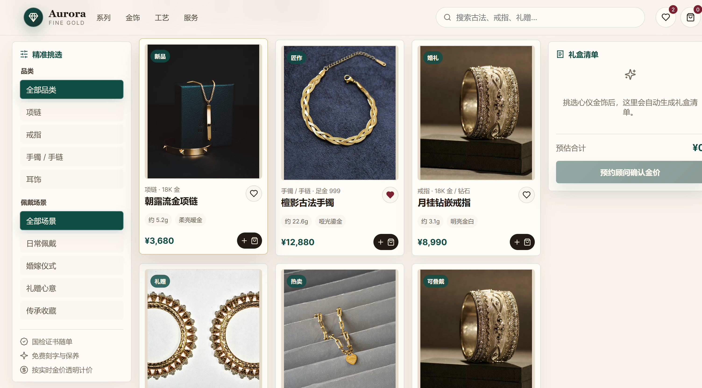

# Aurora 金饰精品商城

一个基于 React + TypeScript + Vite 构建的金饰精品商城前端项目，面向金饰品牌展示、商品筛选、礼盒选购和线上导购场景。

## 项目预览



## 项目简介

本项目主要解决金饰商品在线展示中信息分散、筛选路径不清、用户难以快速完成选品决策的问题。页面整合了精选商品展示、商品列表、品类筛选、场景筛选、关键词搜索、收藏统计和购物车摘要等功能，帮助用户按材质、克重、价格、佩戴场景和商品类型快速浏览金饰。

## 核心功能

- 金饰商品展示
- 精选商品详情区
- 按品类筛选商品
- 按佩戴场景筛选商品
- 商品关键词搜索
- 商品收藏状态切换
- 加入购物车与数量调整
- 自动计算购物车预估合计
- 响应式页面适配

## 技术栈

- React
- TypeScript
- Vite
- Lucide React
- CSS

## 本地运行

安装依赖：

```bash
npm install
```

启动开发环境：

```bash
npm run dev
```

构建生产版本：

```bash
npm run build
```

预览生产构建：

```bash
npm run preview
```

## 项目结构

```text
src
├── components
│   ├── cart-summary.tsx
│   ├── collection-strip.tsx
│   ├── filter-panel.tsx
│   ├── header.tsx
│   ├── product-card.tsx
│   ├── product-grid.tsx
│   └── product-spotlight.tsx
├── data
│   └── products.ts
├── hooks
│   └── use-product-explorer.ts
├── types
│   └── product.ts
├── utils
│   └── format.ts
├── App.tsx
├── main.tsx
└── styles.css
```

## 主要逻辑

项目通过 `useProductExplorer` 自定义 Hook 统一管理商品浏览相关状态，包括当前选中商品、搜索关键词、品类筛选、场景筛选、收藏商品、购物车商品和总价计算。

页面组件负责展示和交互，商品数据目前存放在 `src/data/products.ts` 中，后续可以替换为后端接口或 CMS 数据源。

## 适用场景

- 金饰品牌官网
- 珠宝商城前端页面
- 商品展示型电商项目
- React + TypeScript 前端练习项目
- 后续接入真实后端接口的商城原型

## 说明

当前项目为前端静态商城展示版本，暂未接入用户登录、支付、订单管理和后端数据库。
